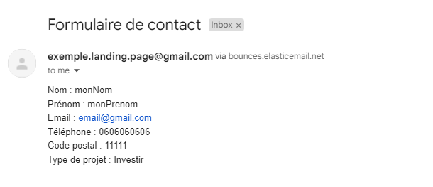

# 🏘️ Landing page pour un site web immobilier


## Description

Ce projet est une landing page simple d'un site pour une entreprise immobilière. Vous pourrez notamment y retrouver un caroussel d'images (fictif), une section de présentation ainsi qu'un formulaire de contact.


## Technologies

- HTML
- CSS (SASS)
- JavaScript
- Node.js


## Installation

1. **Cloner le dépôt Git** : Clonez ce dépôt sur votre machine locale en utilisant la commande git suivante :
```bash
git clone git@github.com:Coaraa/landing-page.git 
```

2. **Ouvrez le projet** : Il suffit d'ouvrir le fichier `index.html` dans votre navigateur web pour visualiser la page.

OU 

2. **Ouvrez le projet avec un serveur local** : Vous pouvez également ouvrir le projet avec un serveur local. Pour cela, vous pouvez utiliser l'extension Live Server de Visual Studio Code.


## Formulaire de contact

Le formulaire de contact est fonctionnel. Les données saisies dans le formulaire sont cependant envoyées à une adresse mail fictive (exemple.landing.page@gmail.com). Les données sont envoyées via une requête SMTP grâce à un serveur de Elastic Email. Elles sont reçues de la façon suivante :



Pour modifier les données de contact, vous pouvez modifier les variables dans la fonction `sendEmail()` du fichier `script.js`.